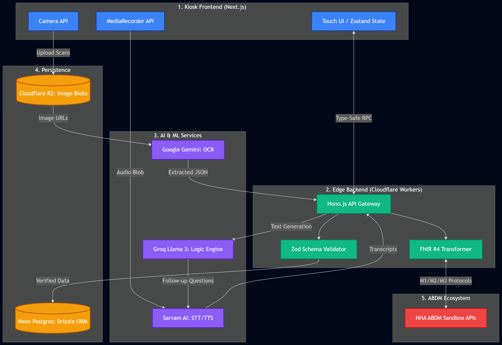

<p align="center">
  
</p>

<h1 align="center">🌿 VaidyaSetu</h1>

<p align="center">
  <strong>AI-native clinical history platform for Indian government AYUSH OPDs</strong><br/>
  <em>"Bridging the ancient sciences of AYUSH with modern clinical intelligence."</em>
</p>

<p align="center">
  <a href="#"></a>
  <a href="#"></a>
  <a href="#"></a>
  <a href="#"></a>
  <a href="#"></a>
  <a href="#"></a>
</p>

---

## 📸 Preview

<!-- Replace with actual screenshot or GIF -->

<p align="center">
  
</p>

<p align="center">
  <em>Voice-first kiosk interface with real-time triage and multilingual support (Hindi, English, Tamil)</em>
</p>

---

## ✨ Key Features

| | Feature | Description |
|---|---|---|
| 🎙️ | **Voice-First Kiosk** | Hold-to-speak symptom capture with Sarvam AI STT (22 languages), Web Speech API fallback, and real-time audio visualizer |
| 🧠 | **AI Triage Engine** | Groq Llama 3 + Gemini dual-LLM pipeline with SOCRATES pain assessment, red-flag detection, and auto-escalation |
| 📄 | **Medical Document OCR** | Gemini Vision-powered extraction of prescriptions, lab reports, discharge summaries with abnormal value flagging |
| 📋 | **Structured Summaries** | Auto-generated bilingual clinical summaries (physician English + patient local language) following standard medical history format |
| 🔒 | **ABDM Integration** | ABHA verification, FHIR R4 DiagnosticReport generation, DPDP Act 2023-compliant consent capture |
| 🌐 | **Offline-First** | IndexedDB queue with automatic sync — works in low-connectivity government hospital environments |
| 🍃 | **AYUSH Extended** | Dashavidha Pariksha assessment (Prakriti, Vikriti, Agni, Koshtha, Ahara-Vihara, Nidana, Samprapti) |
| ⚡ | **Edge-Native** | Cloudflare Workers + Neon serverless Postgres — zero cold-start penalty on the API layer |

---

## 🛠️ Tech Stack

| Layer | Technology | Why |
|---|---|---|
| **Framework** | Next.js 15 (App Router) | RSC, streaming, Turbopack, edge-ready |
| **UI** | shadcn/ui + Tailwind CSS 4 | Accessible, composable, zero-runtime |
| **API** | Hono.js on Route Handlers | Type-safe RPC, middleware-friendly, edge-compatible |
| **ORM** | Drizzle | Type-safe SQL, zero overhead, relational queries |
| **Database** | Neon (serverless Postgres) | Branching, autoscale, scale-to-zero |
| **Auth** | Clerk | Pre-built components, RBAC, webhook support |
| **AI — Triage** | Groq (Llama 3.3 70B) → Gemini (fallback) | Fast structured JSON, SOCRATES reasoning |
| **AI — OCR** | Gemini 2.5 Flash (Vision) | Document intelligence, handwriting |
| **AI — STT/TTS** | Sarvam AI (saaras:v3 / bulbul:v3) | 22 Indic languages, low-latency |
| **Validation** | Zod | Runtime + static type safety, API schema source-of-truth |
| **State** | Zustand | Minimal, hook-based, devtools support |
| **Testing** | Vitest | Fast, Vite-native, ESM-first |
| **Deployment** | Cloudflare (Workers + Pages + R2) | Edge-native, R2 zero-egress document storage |

---

## 🚀 Quick Start

### Prerequisites

- **Node.js** ≥ 18.17 (LTS recommended)
- **npm** ≥ 9 (ships with Node)
- **Wrangler CLI** — `npm install -g wrangler` (for Cloudflare deployment)
- Accounts on: [Neon](https://neon.tech), [Clerk](https://clerk.com), [Groq](https://console.groq.com), [Google AI Studio](https://aistudio.google.com), [Sarvam AI](https://dashboard.sarvam.ai), [ABDM Sandbox](https://sandbox.abdm.gov.in)

### 1. Clone & Install

```bash
git clone https://github.com/your-username/VaidyaSetu.git
cd VaidyaSetu
npm install
```

### 2. Configure Environment

```bash
cp .env.example .env.local
```

Fill in **every** key — the app will fail-fast at boot with a formatted error listing all missing variables:

```env
# .env.example
SARVAM_API_KEY=              # Sarvam AI dashboard → API Keys
GROQ_API_KEY=                # Groq console → API Keys
GEMINI_API_KEY=              # Google AI Studio → Get API key
NEXT_PUBLIC_CLERK_PUBLISHABLE_KEY=  # Clerk dashboard → API Keys
CLERK_SECRET_KEY=            # Clerk dashboard → API Keys
DATABASE_URL=                # Neon → Connection Details → Pooled string
ABDM_CLIENT_ID=              # ABDM Sandbox → Client credentials
ABDM_CLIENT_SECRET=          # ABDM Sandbox → Client credentials
```

### 3. Set Up Database

```bash
npm run db:generate    # Generate migration SQL from Drizzle schema
npm run db:migrate     # Apply migrations to your Neon database
```

### 4. Run Development Server

```bash
npm run dev            # Starts Next.js on http://localhost:3000 (Turbopack)
```

### 5. Verify

- Visit `http://localhost:3000` — Kiosk welcome screen
- Visit `http://localhost:3000/api/health` — should return `{ "status": "ok" }`

### Available Scripts

| Command | Description |
|---|---|
| `npm run dev` | Start dev server with Turbopack |
| `npm run build` | Production build |
| `npm run start` | Start production server |
| `npm run lint` | ESLint check |
| `npm test` | Run Vitest in watch mode |
| `npm run test:run` | Run Vitest once |
| `npm run db:generate` | Generate Drizzle migrations |
| `npm run db:migrate` | Apply database migrations |
| `npm run db:push` | Push schema directly (development) |
| `npm run db:studio` | Open Drizzle Studio GUI |

---

## 🏗️ Architecture

### Project Structure

```
VaidyaSetu/
├── app/
│   ├── (kiosk)/                      # Patient-facing kiosk routes (route group)
│   │   ├── layout.tsx                #   Kiosk shell layout
│   │   ├── page.tsx                  #   Welcome / language select / consultation UI
│   │   └── encounter/
│   │       └── page.tsx              #   Voice encounter capture page
│   ├── api/
│   │   └── [[...route]]/
│   │       └── route.ts              #   Hono.js catch-all mount (sessions, AI, docs)
│   ├── layout.tsx                    # Root layout (Clerk, fonts, Toaster)
│   ├── globals.css                   # Tailwind base + CSS variables
│   └── favicon.ico
│
├── components/
│   ├── HoldToSpeak.tsx               # Voice input button with audio visualizer
│   └── ui/                           # shadcn/ui primitives (do not hand-edit)
│       ├── button.tsx
│       ├── card.tsx
│       ├── progress.tsx
│       └── sonner.tsx
│
├── lib/
│   ├── ai/                           # AI service wrappers (Result<T> pattern)
│   │   ├── index.ts                  #   Barrel re-exports
│   │   ├── sarvam.ts                 #   STT (saaras:v3), TTS, Translation
│   │   ├── groq.ts                   #   Triage (Llama 3), Summary generation
│   │   ├── gemini.ts                 #   OCR (Vision), Triage fallback
│   │   ├── abdm.ts                   #   ABDM OAuth2, ABHA verify, FHIR mapper
│   │   └── abdm.test.ts             #   Integration tests for ABDM
│   ├── db/
│   │   ├── index.ts                  #   Drizzle client (Neon HTTP driver)
│   │   └── schema.ts                 #   All tables: patients, sessions, conversations,
│   │                                 #     documents, summaries, abdm_links + Zod schemas
│   ├── store/
│   │   └── session.ts                #   Zustand store (session, transcript, offline queue)
│   ├── env.ts                        #   Zod-validated env vars (fail-fast at import)
│   ├── types.ts                      #   Result<T>, domain primitives, branded IDs
│   ├── api-client.ts                 #   Hono RPC client (type-safe fetch)
│   └── utils.ts                      #   cn() — Tailwind class merge utility
│
├── docs/
│   ├── MODULE_CONTRACT.md            # Module boundaries, public APIs, FHIR touchpoints
│   └── fhir-diagnostic-report.sample.json
│
├── human/
│   ├── Blueprint.md                  # Master plan, 12-phase roadmap, AI strategy
│   ├── Architecture.png              # Visual architecture diagram
│   └── *.pdf                         # Original spec documents
│
├── drizzle.config.ts                 # Drizzle Kit configuration
├── wrangler.toml                     # Cloudflare Workers + R2 binding
├── AGENTS.md                         # AI agent coding guidelines
├── GEMINI.md                         # Antigravity workspace overrides
├── package.json
├── tsconfig.json
├── vitest.config.ts
└── .env.example
```

### System Architecture

```
┌─────────────────────────────────────────────────────────────────┐
│                      Kiosk Frontend (Next.js 15)                │
│    Camera API │ MediaRecorder API │ Touch UI / Zustand State    │
├─────────────────────────┬───────────────────────────────────────┤
│                         │ Type-Safe RPC (Hono Client)           │
│                         ▼                                       │
│              ┌─────────────────────────────────┐                │
│              │  Edge Backend (Hono.js + Zod)   │                │
│              │  /api/sessions  /api/ai          │                │
│              └──────┬──────────────┬────────────┘                │
│                     │              │                             │
│         ┌───────────┘              └──────────┐                 │
│         ▼                                     ▼                 │
│  ┌──────────────────┐              ┌─────────────────────┐      │
│  │  AI / ML Services│              │   Persistence       │      │
│  │  Sarvam (STT/TTS)│              │   Neon Postgres     │      │
│  │  Groq (Triage)   │              │   Drizzle ORM       │      │
│  │  Gemini (OCR)    │              │   Cloudflare R2     │      │
│  └──────────────────┘              └─────────────────────┘      │
│                     │                                           │
│                     ▼                                           │
│              ┌─────────────────────────────────┐                │
│              │  ABDM Ecosystem (V3 APIs)       │                │
│              │  FHIR R4 · ABHA · Consent       │                │
│              └─────────────────────────────────┘                │
└─────────────────────────────────────────────────────────────────┘
```

### Four Core Modules

| Module | Responsibility | Status |
|---|---|---|
| **A — ConversationalHistoryEngine** | Adaptive voice/touch interview, SOCRATES branching, Dashavidha Pariksha, red-flag detection | 🟡 In progress |
| **B — MedicalDocumentIntelligence** | OCR ingestion, timeline construction, abnormal lab flagging | 🟡 In progress |
| **C — StructuredSummaryGenerator** | Transcript + OCR → bilingual clinical summary (stateless transform) | ⬜ Planned |
| **D — ConsentPrivacyIntegration** | ABDM OAuth2, ABHA verification, DPDP consent, session wipe | 🟡 In progress |

> Module boundaries are enforced by [`docs/MODULE_CONTRACT.md`](docs/MODULE_CONTRACT.md) — read before contributing.

---

## 🗺️ Roadmap

| Phase | Description | Status |
|---|---|---|
| 1 | Domain Deconstruction & Module Contracts | ✅ |
| 2 | Technology Stack Selection & Scaffold | ✅ |
| 3 | Free Toolchain Assembly (AI stubs, schema) | ✅ |
| 4 | Environment & Secrets Wiring | ✅ |
| 5 | Free-Tier Hosting (Cloudflare) | ✅ |
| 6 | AI Coding Toolkit & Guardrails | ✅ |
| 7 | Anchor Files & Reference Extraction | ✅ |
| 8 | Schema & ORM Foundation | ✅ |
| 9 | Conversational History Engine (Module A) | 🔄 |
| 10 | Medical Document Intelligence (Module B) | 🔄 |
| 11 | Structured Summary Generator (Module C) | ⬜ |
| 12 | Consent, Privacy & ABDM (Module D) | ⬜ |

---

## 🤝 Contributing

Contributions are welcome! Please follow these guidelines:

1. **Read first**: [`AGENTS.md`](AGENTS.md) for coding rules, [`docs/MODULE_CONTRACT.md`](docs/MODULE_CONTRACT.md) for module boundaries
2. **Branch**: Create a feature branch from `main`
3. **Code**: TypeScript strict mode, no `any`, every export has explicit return types
4. **Validate**: Every payload validated with Zod before touching business logic
5. **Test**: Add/update tests — `npm run test:run`
6. **Lint**: `npm run lint` must pass
7. **Type-check**: `npx tsc --noEmit` must pass
8. **PR**: Open a PR with a clear description of changes

### Hard Rules (from AGENTS.md)

- ❌ No `db.execute()` with raw string templates — Drizzle typed queries only
- ❌ No empty `catch` blocks — always re-throw with context or `console.error` with trace
- ❌ No guessing clinical logic — return a typed `TODO`/`NotImplemented` error state
- ❌ No importing across module internals — only via the module's `api.ts` barrel
- ❌ No direct AI calls outside `lib/ai/` gateway — even "just one quick call"

---

## 📄 License

This project is licensed under the [MIT License](LICENSE).

---

## 🙏 Acknowledgments

- **Ministry of AYUSH** — Problem Statement 26047
- **NHA ABDM** — Health data interoperability standards
- **Sarvam AI** — Indic speech intelligence
- **Groq** — Ultra-fast LLM inference
- **Google AI** — Gemini vision & language models
- **Neon** — Serverless Postgres infrastructure

---

<p align="center">
  <strong>VaidyaSetu</strong> — वैद्यसेतु — <em>Bridge of the Healer</em><br/>
  Built with ❤️ for Indian public health
</p>
